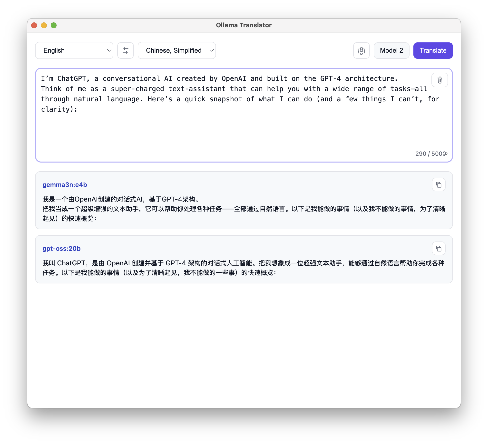

# Ollama Translator

A minimal, static web app to translate text using one or more Ollama models. Matches the provided UI reference and runs entirely in the browser.




## Features
- Language selection with swap (English, Chinese, Simplified, Japanese, Korean)
- Settings modal to configure Ollama API base URL
- Uses both Ollama and OpenAI-compatible APIs simultaneously (when configured)
- No model selection UI; discovers all available models from both providers
- Clear separators group results by provider, one card per model
- LocalStorage persistence for API URL and selected models
- Results support Markdown formatting (headings, lists, code, links),
  including syntax highlighting for common languages (JS/TS, JSON, Python, Bash)
  and GitHub-style tables.

## Quick Start
1. Ensure Ollama is running and models are available.
   - Default API: `http://localhost:11434`
   - List images: `ollama list`
2. Serve this folder (to avoid browser CORS restrictions):
   - Python: `python3 -m http.server`
   - Node: `npx serve` (if available)
3. Open the served URL in your browser (e.g., `http://localhost:8000`).
4. Click the gear icon to confirm/set the Ollama API base URL.
5. Click “Model” to select one or more models (images).
6. Enter text and click “Translate”. Results appear in order of selection.

## Configuration
- Base URLs:
  - `ollama_base_url` (default `http://localhost:11434`)
  - `openai_base_url` (default `https://api.openai.com/v1`)
- Token: `openai_token` (if set, enables OpenAI-compatible access)

## API Endpoints Used
- Ollama:
  - `GET /api/tags` — list available images (models)
  - `POST /api/generate` with `{ model, prompt, stream: true }` — streaming translation (NDJSON)
- OpenAI-compatible:
  - `GET /v1/models` — list available models (requires token)
  - `POST /v1/chat/completions` with streaming — reads SSE `data:` chunks

## Notes
- CORS: When opening `index.html` directly via `file://`, browsers typically block requests. Serve the folder as shown above. If needed, configure Ollama origins (version-dependent), e.g. `export OLLAMA_ORIGINS=*` when starting Ollama.
- The app is framework-free (HTML/CSS/JS). No build step is required.
- If using an OpenAI-compatible provider, set the base URL to the provider’s API root (e.g., `https://api.openai.com/v1`) and provide a valid token.

## Files
- `index.html` — Page structure and modals
- `styles.css` — Styling and layout
- `app.js` — UI logic and API calls

## Desktop Apps (Electron)
- Location: the Electron project lives in `app/` with its own `package.json`.

### Prerequisites
- Node.js 18+
- macOS: Xcode command line tools (`xcode-select --install`)
- Windows: Visual Studio Build Tools (for electron-builder), PowerShell

### Run in development
```
cd app
npm install
npm run start
```

### Build installers
- Cross‑platform build from each OS:
  - macOS DMG/APP:
    - `cd app && npm run build:mac`
  - Windows NSIS installer:
    - `cd app && npm run build:win`
- Generic build alias (uses host platform):
```
cd app
npm run build
```
Outputs are placed in `app/dist/`.

### CORS and Ollama
- The desktop app still makes HTTP requests to the Ollama API. If requests fail due to CORS, allow the app origin in Ollama or relax origins while testing.
- Example (shell):
```
export OLLAMA_ORIGINS=*
ollama serve
```
Alternatively, we can add an Electron main‑process proxy to bypass CORS. Ask if you want this wired.

## License
This project is provided as-is for demonstration purposes.
